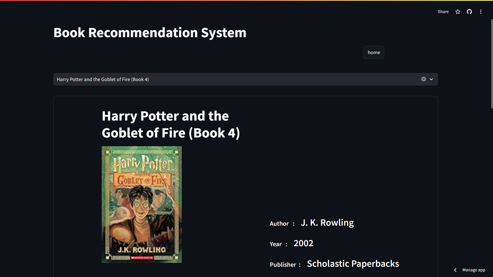
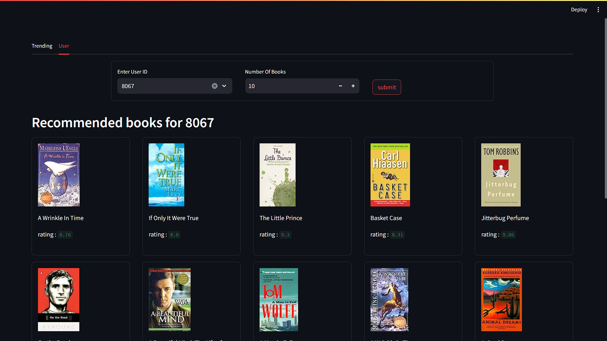
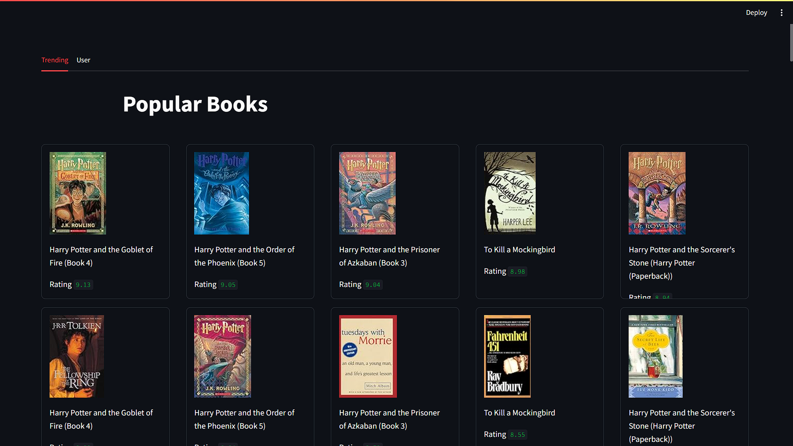

# 📚 BookCompass - Personalized Book Recommendation System
BookCompass is an intelligent, personalized Book Recommendation System web application designed to help readers discover their next great read. The application leverages advanced recommendation algorithms to suggest books tailored to each user’s preferences and interactions.

🌐 Live Demo https://book-compass.streamlit.app/

## 📊 Project Overview
BookCompass is a smart, data-driven book recommendation system that helps users discover their next favorite read using collaborative filtering (user-based and item-based) and popularity-based recommendations. Whether you're an avid reader or just starting your literary journey, BookCompass tailors suggestions based on your past interactions and the reading habits of like-minded users.

Developed using Streamlit, BookCompass offers a user-friendly interface and is hosted on Streamlit Cloud for seamless accessibility.





## ✨ Features
#### 1. Personalized Recommendations
- Learns from user interactions to provide tailored recommendations, enhancing the user experience over time.
#### 2. Collaborative Filtering
- **User-Based Filtering**: Identifies users with similar interests, forms clusters, and recommends books based on group preferences.
- **Item-Based Filtering**: Recommends books similar to the ones a user has already read or interacted with.


####
#### 3. Popularity-Based Recommendation
- Popularity-Based Suggestions: Shows trending books based on overall user ratings and interactions.

##

###

#### 4. User-Friendly Interface
- Built with Streamlit for a seamless, interactive web experience.
- Easy-to-navigate design with book covers, ratings, and summaries.
#### 5. Scalable & Efficient
- Hosted on Streamlit Cloud for fast and reliable access.
- Optimized recommendation algorithms for real-time suggestions.

## 🛠️ Technologies Used
- Python 3.9+
- Streamlit (Web Application Framework)
- Collaborative Filtering Algorithms
- Popularity-Based Ranking
- Streamlit Cloud (Deployment)


## 📂 Project Structure


```bash
BookCompass/ 
├── app
│    └── app.py
│   
├── artifacts
│    ├── book_data.pkl
│    ├── similarity_data.pkl
│    └── top_50_books.pkl
│
├── images
│
├── src
│    ├── data_preprocessing.ipynb
│    └── recommendation_system.ipynb
│
├──requirements.txt
│
└── README.md
```

## 🚀 Getting Started
1. Clone the Repository
```bash
git clone https://github.com/Shabeenabd/BookCompass-RecommendationSystem.git
cd BookCompass
```
2. Set up a virtual environment
```bash
python -m venv venv
source venv/bin/activate
# On Windows
venv\Scripts\activate
```
3. Install Dependencies
```bash
pip install -r requirements.txt
```
4. Run the Streamlit App
```bash
cd app
streamlit run app.py
```


## 🧠 How It Works
#### 1. Data Collection & Preprocessing
- The system uses a dataset of books and user interactions (ratings, reads)
- Data is cleaned and transformed into a user-item interaction matrix.
#### 2. Collaborative Filtering
- **Item-Based Filtering**: Analyzes the user’s previously read books and suggests similar titles based on content similarity and user preferences.
- **User-Based Filtering**: Finds users with similar reading habits, clusters them, and recommends books popular within the cluster.
#### 3. Popularity-Based Recommendations 
- Identifies and displays books that are widely read, highly rated, or currently trending across the platform.
#### 4. Real-Time Personalization
- Streamlit web app adapts recommendations dynamically based on user activity and past interactions.
## 🎯 Future Enhancements
- Hybrid Recommendation System: Combine collaborative filtering with content-based filtering (using book descriptions, genres).
- User Authentication: Allow users to save their reading history and preferences.
- Goodreads API Integration: Fetch real-time book data and reviews.

[](https://forthebadge.com)

